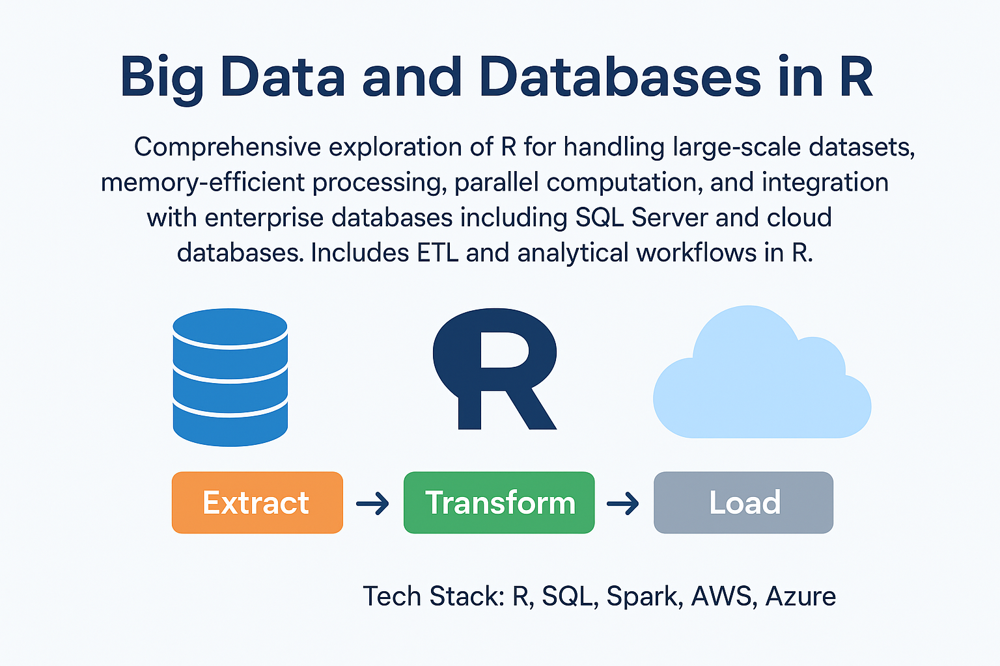
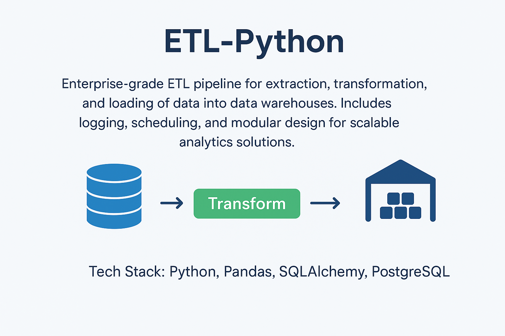
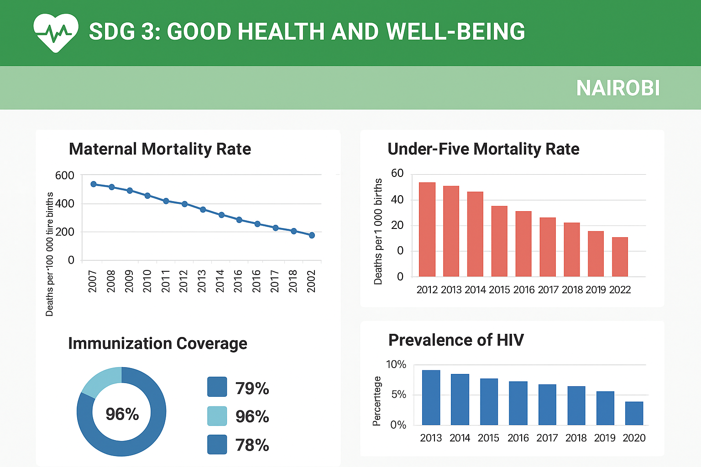

# Solomon Were Oindo

**Analytics | Scientist | Thinker**  
[LinkedIn](https://www.linkedin.com/in/solomonwere) | [Email](mailto:oindosolo705@gmail.com) | +254 705 234 581

Experienced data professional with 5+ years spanning data operations, analytics, and AI-driven solutions. I specialize in transforming raw data into actionable insights through machine learning, business intelligence, and automation. Skilled at bridging technical depth with business needs, while ensuring compliance with Kenya’s Data Protection Act (2019) and GDPR.

Currently pursuing advanced mastery in data science at the Co-operative University of Kenya.

---

## Key Highlights

- Built and deployed machine learning forecasting models using PyCaret and Streamlit.  
- Designed and delivered enterprise-level dashboards with Power BI and Tableau.  
- Delivered analytics solutions across government institutions and private sector organizations, consistently exceeding expectations.  
- Strong expertise in SQL, Python, R, Power BI, Tableau, AWS, Azure.  
- Experienced in ETL pipelines, Big Data processing, and database integration.

---

## Projects

| Big Data and Databases in R | ETL-Python | SDG-Power-BI |
|-----------------------------|------------|--------------|
| 
   Comprehensive exploration of R for handling large datasets, memory-efficient processing, parallel computation, and integration with enterprise databases. <b>Tech Stack:</b> R, SQL, Spark, AWS, Azure <a href="https://github.com/solowere/Big-Data-and-Database-in-R">View Repository</a> 
 | 
   Enterprise-grade ETL pipeline for extraction, transformation, and loading of data into data warehouses. <b>Tech Stack:</b> Python, Pandas, SQLAlchemy, SQL Server <a href="https://github.com/solowere/ETL-Python">View Repository</a> 
 | 
   Power BI dashboards visualizing health indicators for Nairobi, mapped to SDGs. <b>Tech Stack:</b> Power BI, SQL, DAX, Excel <a href="https://github.com/solowere/SDG-Power-BI">View Repository</a> 
 |

---

## Skills & Tools

**Programming & Analytics:** Python, R, SQL, PyCaret, Pandas, NumPy, Scikit-learn, Spark  
**Visualization & BI:** Power BI, Tableau, Excel, Matplotlib, Seaborn  
**Data Engineering:** ETL pipelines, SQLAlchemy, Data Warehouses, Cloud Storage (AWS, Azure)  
**Deployment & Automation:** Streamlit, Git, GitHub Pages, CI/CD pipelines  

---

## Contact

Feel free to reach out via LinkedIn or Email for collaborations, consulting, or opportunities.  

- [LinkedIn](https://www.linkedin.com/in/solomonwere)  
- [Email](mailto:oindosolo705@gmail.com)  
- Phone: +254 705 234 581  

---

*Portfolio maintained by Solomon Were Oindo.*
